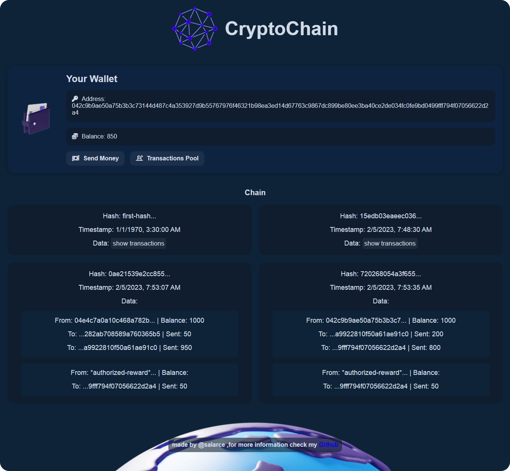
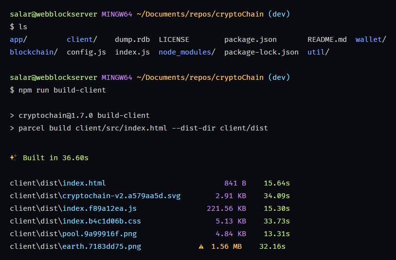
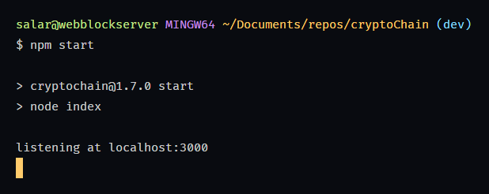
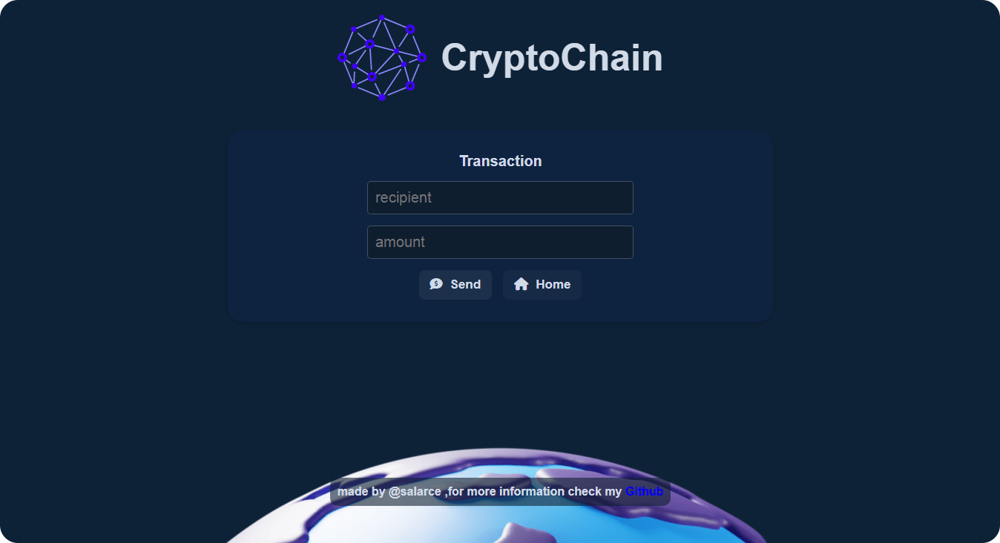
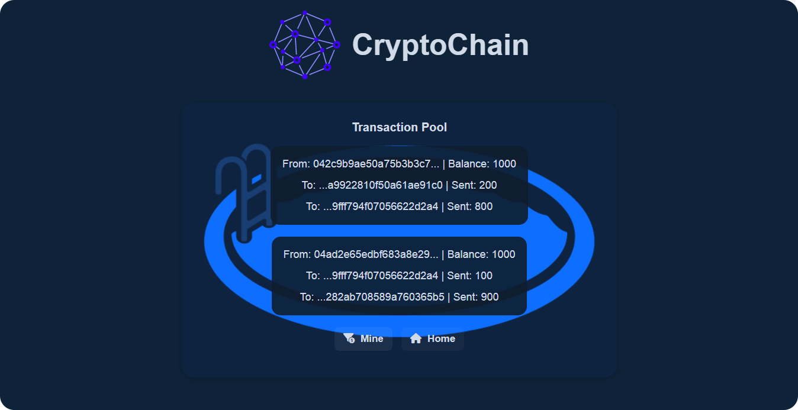

# cryptoChain

A **Blockchain network** for transferring assets via its coin.
Each computer on the network, which runs the program, is connected to a database of transactions, and can also interact with other nodes on the network through these transactions.

> it's written in **TDD** method, in addition that you can see exactly why i wrote them. You can find it on [tdd branch](https://github.com/salarce/cryptoChain/tree/tdd/).



## Deployment

First of all Fork and clone this repo, then copy it and keep it somewhere on your hard drive.
Use following command to build panel:
```
npm run build-client
```


To run the network, **Redis** must already be installed and running.
```
redis-server
```

Then use next command for running project:
```
npm start
```


## Features

- Familiarity the blockchain network
- Implementation with nodejs
- Using TDD method
- React for UI





## Documentation

> If you know persian language, it can be good to read my documentation from this [LINK]().

## Cooperation
If you're familiar with JavaScript and have comments about problems, or improvements about the project; I welcome your participation.

## License
This repository is licensed under the GPL-2.0 license. See the [LICENSE](LICENSE) file for more information.